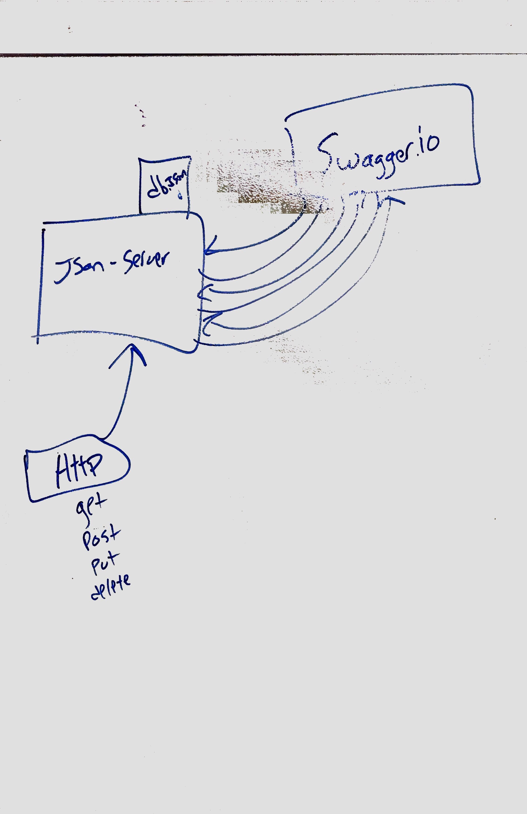

# LAB - 6

## HTTP and REST

### Adriana Graybill and Lee helped with creating an image for class reference

### Links and Resources
* [submission PR](https://github.com/adriana-401-advanced-javascript/simple-api/pull/1)
* [Front-end](https://codesandbox.io/s/api-client-f2b1t)

#### Documentation
* [api docs](./docs/swagger.json) (API servers)

###### Usage Notes or examples
``` echo '{"id": 1, "description":"updated description","display_name": "a thing", "name":"philbert"}'```
to GET info on the selected ID.
``` echo '{"id": 1, "description":"updated description","display_name": "a thing", "name":"philbert"}' | http put :3000/categories/2 ``` to PUT (or update) information in the selected ID.
```echo '{"id": 3, "description":"super nice","display_name": "a thing", "name":"philbert"}' | http post :3000/categories```
to POST (or create) an entry - must use a new ID.
```http delete :3000/categories/3```
to DELETE an entry - must use an existing ID.

### Setup
#### `.env` requirements
* `PORT 3000` - Port Number

#### Running the app
* json-server --watch ./data/db.json into terminal to run server, open second terminal

#### UML

